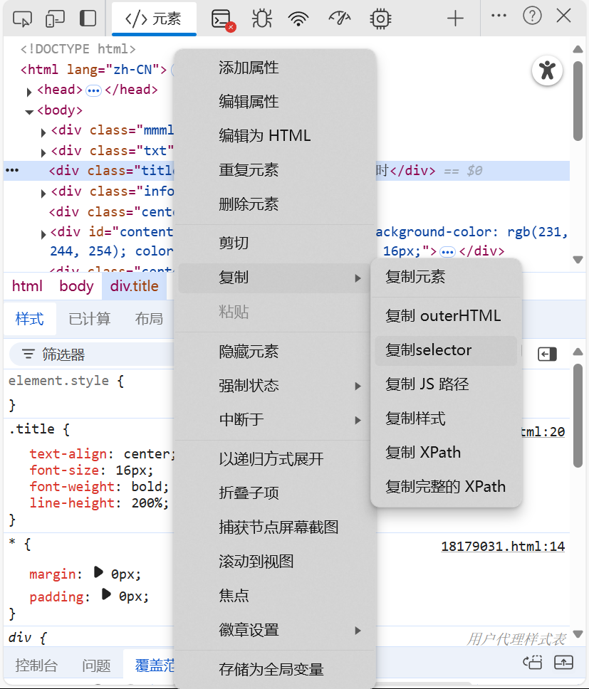

# 小白也会的 超简单爬取方法！

## 1.复制文件
打开 `lib/` 文件夹，随机找一个`.t.ts`结尾的文件，复制，粘贴一份<br>
复制你的网址 杠中间那个 网址主机名，如

https://`www.nzxs.cc`/read/291722/64812338.html

黑的那一部分就是了，然后重命名为`<主机名>.t.ts`，如 `www.nzxs.cc.t.ts`

## 2. 找到selector
按`F12`打开开发者页面，如果不行大概率你得放弃这个网站了<br>
点箭头，鼠标移动到标题上，调整位置，显示的蓝色块越小越好


然后右键高亮的代码，点击“复制 -> 复制selector”



按照这样，复制
 - 标题内容，填入 `title`后的引号内
 - 正文，`content`
 - 下一页，`next_link`

下一页也许很难找，但是是必须的，翻到底下找找


## 3. 进阶
在“未找到内容”打上断点(VSCode)，在`debug.json`写上网址，如

```json
{
    "url": "https://www.habzpe.com/book/57575/18179031.html"
}
```

安装Deno扩展后，在`main.ts`文件内`F5`就可以快乐调试啦