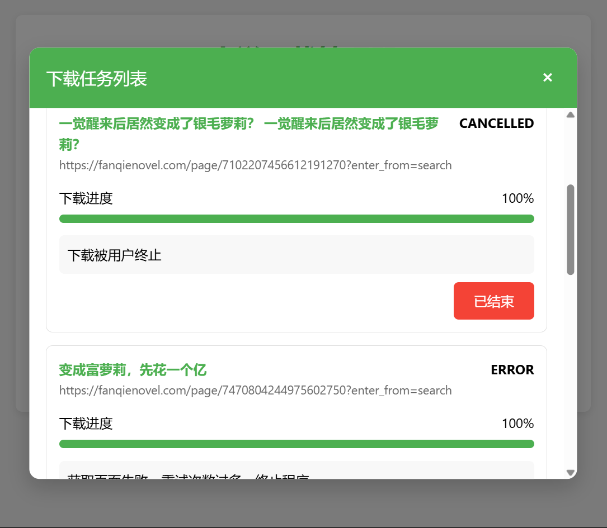

# 超级下载器(基于deno)
下载各个盗版网站/正版网站web版的小说/漫画程序<br>
同时也有各种周边工具，如转epub、格式化、查找等<br>
写了主要是给自己用的，欢迎大家补充<br>
进阶玩法（自己添加网页，很简单的教程）: [教程](docs)

# 特色
 - 强大的爬取功能，伪造标头/类浏览器Cookie持久化/原生JS eval
 - 超强的样式、图片保留，支持 加粗/斜体/轻小说对话美化/各种图片 等等
 - 小说/漫画都支持，只需要写扩展脚本即可增加站点支持
 - 繁体转换、自动分章等好用的功能，只为舒心的阅读体验
 - 油猴扩展，一键下载，立即判断是否支持，超级舒心的体验！
 - 支持cbz/epub/长图片漫画下载，多线程漫画转换长图片(cbz2img)！

# 目前已经支持？
看`lib/`文件夹都是已经支持的
 - 番茄：目前有3个可用源(1个需要登陆)，1个未知源。**且用且珍惜！**
 - sfacg：web
 - 刺猬猫(实验性)：WebAPI
 - esjZone：web + WebAPI

漫画支持(`cbz` / `epub`)
 - 包子漫画(baozimh.org www.baozimhcn.com manhuafree.com)
 - dm5漫画人 (tel.dm5.com)
 - sfacg漫画(manhua.sfacg.com)
 - 拷贝漫画(www.mangacopy.com)

# 怎么用？
**注意** 有部分网站有CC保护，请合理安排间隔时间 "-s"
## 终端（不推荐）
虽然功能更全，但是是单任务的。<br>
从右侧release下载denovel.exe，打开终端，拖入二进制即可体验
```sh
    denovel downovel <url> -s 5 -l -e
```
强烈建议：搭配以下flag使用:
 - `-e` 输出epub
 - `-s` 请求间隔时间，重试不受影响
 - `-p` 有些奇葩的网站内容自带章节标题且内容零散，指定可以避免程序自动添加网页给的标题<br>
    再简单点就是网页上的章节标题没有任何作用，指定让denovel忽略它

## 网页端

```sh
    denovel server
```
打开"127.0.0.1:8000"即可

### 进阶用法：浏览器扩展
请确保你安装了 油猴（又称 篡改猴）<br>
打开：
https://greasyfork.org/zh-CN/scripts/546122-bing%E5%B0%8F%E8%AF%B4%E8%87%AA%E5%8A%A8%E4%B8%8B%E8%BD%BD%E5%8A%A9%E6%89%8B
安装即可

安装后，请使用bing搜索，建议搜索时添加“小说”关键词，当然脚本也会自动判断为你省力<br>
当出现“配置不完整”时，请点击链接，复制第一章链接和其余信息，手动下载<br>
看到“可下载”后点击按钮，出现成功弹窗后打开控制台，点击“刷新队列”即可


## 转换epub(支持传入文件夹批量转换)
```sh
    denovel 2epub.ts <文件(夹)>
```
txt支持许多格式，冷门的热门的标题方案都有兼容（太牵强的没有）
目前成功率99.9%，但是有误判的可能，使用 `2txt.ts` 可以反过程

## 下载漫画
与小说下载相似，使用相同的命令格式（但不一定有用）<br>
下载漫画更复杂，需要处理HTTP源等，因此每个文件都是不同的实现方法<br>
相似的，使用命令处理，支持断点。输出的zComicLib文件(<小说名>.<网站>.txt)可以传递给文件作为参数继续下载

```sh
    denovel downcomic <可选，缓存文件>
```

输出epub(cbz好像也不错呢，epub安卓上可用的工具更多)

# 蓝奏云下载器
下载无需密码的部分（支持文件夹递归，使用eval获取100%的兼容性）<br>
暂时用不到密码解锁，有需要欢迎issue

**注意** 蓝奏有严格的时间间隔检查，否则会400(坑死我了)。下载很慢，千万不要改源代码

```sh
    denovel lanzou
```

# 还有的文件都是用来干什么的？
都是平时爬虫攒的小东西，留作备份便与下次改一改使用

2025 iz copyright(c) MIT License
程序初衷是自用，请不要用于违法用途