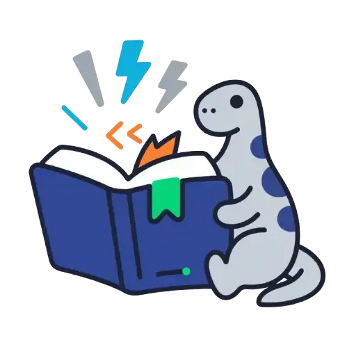

# denovel 超级下载器 V2



下载各个盗版网站/正版网站web版的小说/漫画程序<br>
同时也有各种周边工具，如转epub、格式化、查找等<br>
写了主要是给自己用的，欢迎大家补充<br>

# 特色
 - 强大的爬取功能，伪造标头/类浏览器Cookie持久化/原生JS eval
 - 超强的样式、图片保留，支持 加粗/斜体/轻小说对话美化/各种图片 等等
 - 小说/漫画都支持，只需要写扩展脚本即可增加站点支持
 - 繁体转换、自动分章等好用的功能，只为舒心的阅读体验
 - 油猴扩展，一键下载，立即判断是否支持，超级舒心的体验！
 - 支持cbz/epub/长图片漫画下载，多线程漫画转换长图片(cbz2img)！
 - 内容服务API，支持"/content?url=..."式，即使不下载也可以完美预览！
 - 支持手动更新，指定txt自动爬取小说更新内容！

# 目前已经支持？
看`lib/`文件夹都是已经支持的
 - 番茄：<del>目前有3个可用源(1个需要登陆)，1个未知源。**且用且珍惜！**<del>
    番茄应该不再更新，推荐使用 `fqnovel-unidbg` 这个项目自行部署
    再搭配 `fqunisrv.ts`下载小说，更快更稳定
 - sfacg：web
 - 刺猬猫：WebAPI
 - 起点(实验性)：web + 浏览器辅助验证
 - esjZone：web + WebAPI
 - <del>masiro</del> 暂时未攻破CF防火墙，可以选择在浏览器中
 - ...(各种笔趣阁，各种盗版小说网站，欢迎issue告诉哪些好用)

漫画支持(`cbz` / `epub`)
 - 包子漫画(baozimh.org www.baozimhcn.com manhuafree.com)
 - dm5漫画人 (tel.dm5.com)
 - sfacg漫画(manhua.sfacg.com)
 - 拷贝漫画(www.mangacopy.com)

## 命令行

```text
deno task help
deno run -A --unstable-kv main.ts downovel <小说URL>
deno run -A --unstable-kv main.ts downovel <已有TXT文件>
deno run -A --unstable-kv main.ts downovel --resume <已有TXT文件>
deno run -A --unstable-kv main.ts downcomic <漫画URL>
deno run -A --unstable-kv main.ts 2epub <TXT文件或目录>
deno run -A --unstable-kv main.ts cbz2img <CBZ文件或目录>
deno run -A --unstable-kv main.ts server
```

漫画下载默认输出带 `ComicInfo.xml` 的 CBZ 分章文件，支持包子漫画、DM5、看漫画、拷贝漫画和 SFACG 等适配器。

小说 TXT 会保存最后章节地址。再次把 TXT 作为参数传给 `downovel`，或使用 `--resume`，会自动删除旧 metadata 并从上次章节继续抓取；请求失败或没有新章节时会恢复原文件。

运行 `deno task check` 和 `deno task test` 可检查项目。

2025 iz copyright(c) MIT License
程序初衷是自用，请不要用于违法用途
